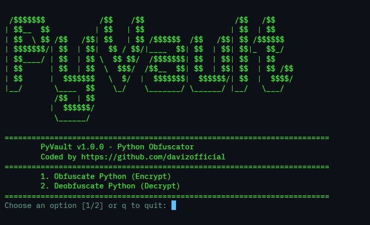
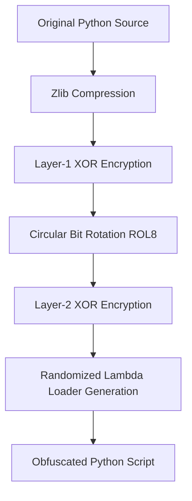

[](https://www.python.org/)
[](https://opensource.org/licenses/MIT)
[](https://www.python.org/)
[](https://github.com/davizofficial)


# PyVault

PyVault is a professional command-line utility designed to protect Python source code. It converts standard Python source files into heavily obfuscated, self-executing loader scripts, and provides an authorized recovery mechanism to restore the original source.

## CLI Preview



---

## The Problem

Python is an interpreted language. Its source code is distributed as plain text or as compiled bytecode (`.pyc` files) that can be easily reverse-engineered. This presents several critical challenges for software developers:

1. **Intellectual Property Exposure**: Proprietary algorithms, business logic, and security workflows are fully exposed to unauthorized inspection.
2. **Insecure Standard Formats**: Standard bytecode compiled files (`.pyc`) are easily decompiled back to plain text source code with high accuracy using readily available automated tools.
3. **Complex or Inflexible Tooling**: Many existing obfuscators require complex setups, generate bloated files, or lack a straightforward, secure way to reverse the process when authorized maintenance, debugging, or auditing is required by the original developer.

---

## The Solution

PyVault solves these challenges by providing a lightweight, fast, and robust multi-layered obfuscation engine with a built-in authorized decryption workflow.



### Multi-Layered Protection

Instead of simply renaming variables or hiding characters, PyVault secures Python scripts through four sequential operations:

1. **Compression**: The source code is compressed using `zlib` at the maximum compression level to optimize memory and alter original byte sequences.
2. **Layer-1 XOR Encryption**: The compressed stream is encrypted with a cryptographically secure, randomly generated first key.
3. **Circular Bit Rotation (ROL8)**: Every byte in the stream undergoes a circular bit shift by a randomized value between 1 and 7 bits, breaking traditional linear analysis.
4. **Layer-2 XOR Encryption**: The shifted stream is encrypted with a second independent cryptographically secure random key.

### In-Memory Execution Loader

The final obfuscated output is wrapped inside a compact, self-executing lambda loader:
* **Randomized Identifiers**: All variables and library references in the loader are randomly generated on every run to prevent pattern analysis.
* **In-Memory Loading**: The loader decrypts, rotates, and decompresses the code entirely in RAM, executing it via Python's standard `compile` and `exec` mechanisms. The plain-text source is never written to disk during execution.

### Authorized Recovery

If the original author needs to debug, update, or audit the protected script, PyVault includes an authorized deobfuscation feature. The tool parses the loader, extracts the keys, reverses the operations (Layer-2 XOR decryption, ROR8 bit rotation, Layer-1 XOR decryption, and zlib decompression), and restores the exact original Python source file.

---

## Key Features

* **Cryptographic Strength**: Employs two independent random keys and randomized circular bit rotation.
* **Zero Dependencies**: Relies entirely on standard Python libraries. No external packages are required to run PyVault or the obfuscated files.
* **Strictly In-Memory**: Execution happens strictly in RAM.
* **Cross-Platform**: Fully compatible with Windows, macOS, and Linux systems.
* **Symmetric Recovery**: Fully supports authorized recovery of original scripts.

---

## Installation

No installation or external library configuration is required. Simply clone the repository or download the source code:

```bash
git clone https://github.com/davizofficial/PyVault.git
cd PyVault
```

---

## How to Use

PyVault provides an interactive menu interface. Start the tool with:

```bash
python PyVault.py
```

### 1. Obfuscating a Python File (Encryption)

To protect your Python script:
1. Select Option **1** from the interactive menu.
2. Enter the path to your input Python file (for example, `test.py`).
3. Enter the desired output path, or press **Enter** to accept the default filename (for example, `test_enc.py`).
4. The tool will write the protected script. You can run it normally:
   ```bash
   python test_enc.py
   ```

### 2. Deobfuscating a Python File (Decryption)

To recover your original source code:
1. Select Option **2** from the interactive menu.
2. Enter the path to the obfuscated Python file (for example, `test_enc.py`).
3. Enter the desired output path, or press **Enter** to accept the default filename (for example, `test_dec.py`).
4. PyVault will reconstruct and write the original script back to disk.

---

## Contribution

Contributions are welcome and play a significant role in improving PyVault. Whether you want to optimize performance, enhance the encryption layers, or improve error handling, your efforts are appreciated.

### How to Contribute

1. **Fork the Repository**: Create your own copy of the project on GitHub.
2. **Create a Feature Branch**: Use a descriptive branch name for your changes:
   ```bash
   git checkout -b feature/improvement-name
   ```
3. **Implement Changes**: Ensure your code is clean, readable, and follows Python best practices. Keep the codebase lightweight by avoiding unnecessary external dependencies.
4. **Test Your Changes**: Verify that both obfuscation and deobfuscation work seamlessly on multiple target scripts.
5. **Submit a Pull Request**: Provide a comprehensive description of the changes made, the problem being solved, and details on how it was tested.

For major modifications, please open an issue first to discuss your proposed changes with the author.

---

## License

This project is licensed under the MIT License.

---

## Disclaimer

This tool is designed for protecting your own intellectual property and for authorized security testing. Do not use PyVault to obfuscate malicious software. The author is not responsible for any misuse or damage caused by this software.
